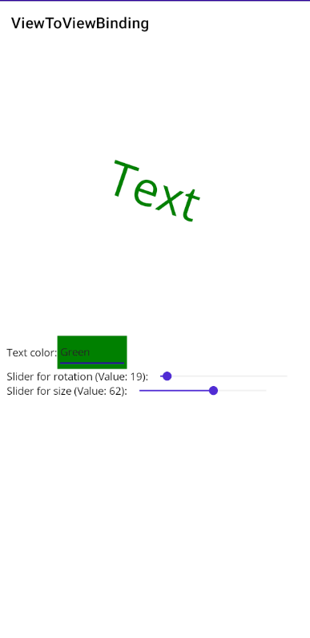
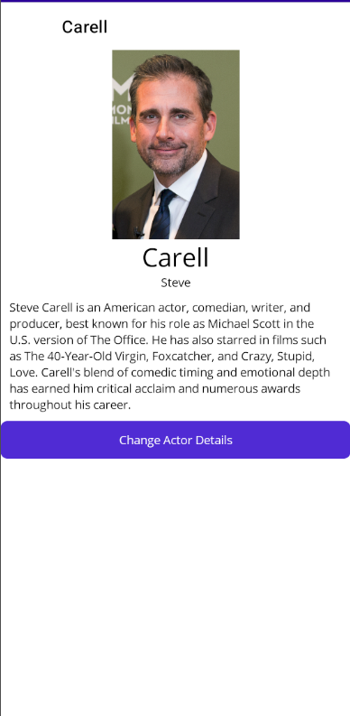

# Labo-Binding
Deze repo biedt basiscode ter ondersteuning van de slides rond Binding. 

## Deel 1 
Breid de oefening rond View-to-View Binding uit zodat je naast de rotatie van de Label ook de grootte (Scale) en kleur (TextColor) kan aanpassen. 

Gebruik de kleuren uit een Picker-element ([documentatie](https://learn.microsoft.com/en-us/dotnet/maui/user-interface/controls/picker?view=net-maui-8.0#respond-to-item-selection)).

*Extra*: Zorg ervoor dat de achtergrond van de geselecteerde kleur ook de achtergrond wordt van de Picker (hint: gebruik een binding met zichzelf).

## Deel 2 
Zorg via bindings dat de ActorDetailPage de correcte informatie toont. 

Maak via een binding ook de title van de pagina in orde!

## Deel 3
Op de ActorDetailPage is een knop voorzien die een wijziging zou moeten aanbrengen op de pagina. Deze werkt momenteel niet, breng dit met behulp van INotifyPropertyChanged in orde.

## Deel 4 
Maak van de ActorsPage de hoofdpagina van de applicatie. 

Zorg dat de lijst van Actors opgehaald en getoond wordt in de interface. Gebruik hiervoor de InMemoryActors-klasse.

Maak een knop die een acteur toevoegd aan de lijst. 

## Deel 5 
Verwijder de knop om de details van een acteur aan te passen op de detailpagina. 

Voeg een TapGesture toe zodat je kan klikken op een item in de lijst om naar de detail pagina te navigeren. 

Experimenteer met de compiled binding.

## Deel 6 
Maak een converter die het geboortejaar omzet naar een leeftijd in jaren. 

Pas deze toe op de detailpagina van een acteur.

Extra: Maak een tweede converter die de achtergrondkleur van de pagina verandert op basis van de eerste letter van de voornaam. Voor namen A-I wordt de achtergrondkleur grijs, voor de namen J-Z wordt de achtergrondkleur lichtblauw.
